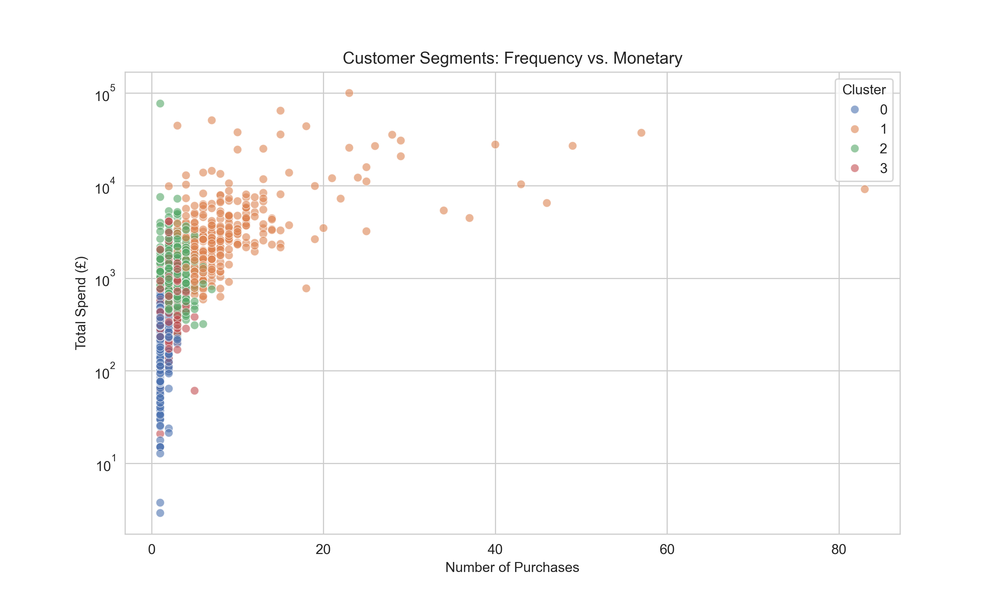
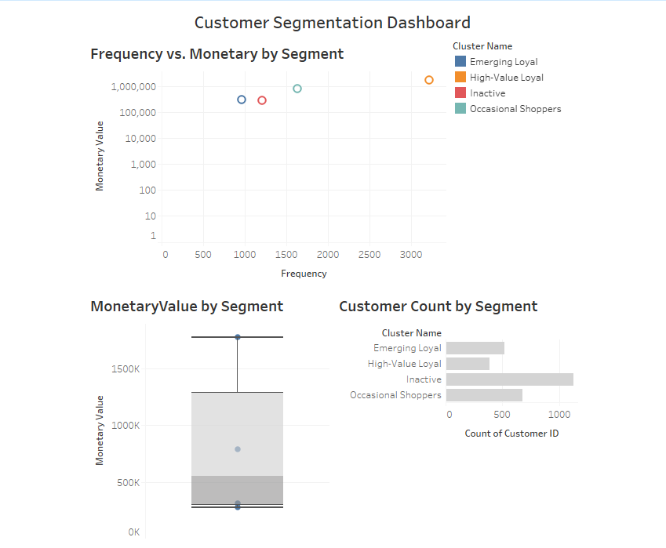

# Customer Segmentation for E-commerce

## Overview
This project analyzes customer purchase data from a UK-based online retailer (2010–2011) to segment customers into actionable groups using RFM (Recency, Frequency, Monetary) analysis and K-means clustering. The goal is to help the business tailor marketing strategies, boost retention, and maximize revenue. Built as a portfolio project to showcase data analysis skills for a junior data analyst role.

## Key Findings
Using RFM metrics and K-means clustering (k=4), I identified four customer segments:
- **High-Value Loyal (~10%)**: Recent shoppers (~10 days), high frequency (~20 purchases), high spend (~£5000). Drive ~56% of revenue.
- **Emerging Loyal (~20%)**: Recent (~30 days), medium frequency (~10), medium spend (~£1000). Growing loyal base.
- **Occasional Shoppers (~30%)**: Less recent (~100 days), low frequency (~3), low spend (~£300). Infrequent buyers.
- **Inactive (~40%)**: Not recent (~200 days), low frequency (~1–2), low spend (~£100). Lapsed customers.

## Marketing Recommendations
- **High-Value Loyal**: Retain with VIP discounts, exclusive products, or loyalty programs.
- **Emerging Loyal**: Encourage repeat purchases with personalized offers or subscriptions.
- **Occasional Shoppers**: Boost engagement with flash sales or targeted promotions.
- **Inactive**: Re-engage via email campaigns, win-back discounts, or churn surveys.

## Visualizations
- **Interactive Dashboard**: Explore segments, RFM distributions, and scatterplots on [Tableau Public](https://public.tableau.com/views/CustomerSegmentationAnalysisforE-commerce/CustomerSegmentationAnalysisforE-commerce?:language=en-US&publish=yes&:sid=&:redirect=auth&:display_count=n&:origin=viz_share_link).
- **Static Visuals**: See `visuals/` for histograms, correlation heatmaps, elbow plot, cluster scatterplots, and boxplots.

## Methodology
1. **Data Cleaning**: Removed missing `CustomerID`, invalid transactions, and added `TotalSpend`.
2. **Feature Engineering**: Calculated RFM metrics (Recency, Frequency, Monetary) with log transformations.
3. **EDA**: Visualized distributions, correlations, and RFM relationships.
4. **Clustering**: Applied K-means (k=4) on standardized log-RFM features.
5. **Visualization**: Built a Tableau dashboard and Python plots.
6. **Storytelling**: Developed business recommendations based on segments.

## Tools Used
- **Python**: Pandas, NumPy, Scikit-learn, Matplotlib, Seaborn
- **Tableau Public**: Interactive dashboard
- **Jupyter Notebook**: Analysis and documentation

## Repository Structure
- `data/`: Cleaned and processed datasets (original data at [UCI](https://archive.ics.uci.edu/ml/datasets/online+retail)).
- `notebooks/segmentation.ipynb`: Full analysis code.
- `visuals/`: Plots and charts.
- `requirements.txt`: Python dependencies.

## How to Run
1. Clone the repo: `git clone https://github.com/yourusername/Customer-Segmentation.git`
2. Install dependencies: `pip install -r requirements.txt`
3. Run `notebooks/segmentation.ipynb` in Jupyter Notebook.
4. View the Tableau dashboard: [Link](https://public.tableau.com/views/CustomerSegmentationAnalysisforE-commerce/CustomerSegmentationAnalysisforE-commerce?:language=en-US&publish=yes&:sid=&:redirect=auth&:display_count=n&:origin=viz_share_link).

## Future Improvements
- Add demographic data for deeper segmentation.
- Implement advanced clustering (e.g., DBSCAN).
- Automate RFM updates with a data pipeline.

## Contact
Built by Deji Felix. Connect with me on [LinkedIn](https://www.linkedin.com/in/deji-felix-0ab880258) or [email](iamerys11@gmail.com) for questions or collabs!

---

